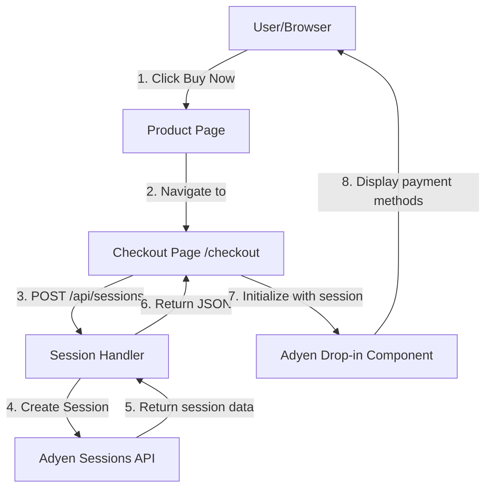

# Plan: Add Adyen Drop-in Checkout UI

Show Adyen Drop-in payment interface when users click "Buy Now". This implements the checkout experience UI using Adyen's Sessions API and Drop-in component, without processing actual payments yet.

## Architecture Overview



## Feature Requirements (Gherkin)

### Feature: Display Adyen Drop-in Checkout
```gherkin
Feature: Adyen Drop-in Checkout Display
  As a customer
  I want to see the Adyen Drop-in payment interface
  So that I can view available payment methods

  Background:
    Given the Adyen test environment is configured
    And the server has valid Adyen credentials

  Scenario: Navigate to checkout from product page
    Given I am viewing the Premium Widget product page
    When I click the "Buy Now" button
    Then I should be redirected to the checkout page
    And I should see the product name "Premium Widget"
    And I should see the price "$1.00"

  Scenario: Display Adyen Drop-in component
    Given I am on the checkout page
    When the page loads
    Then a payment session should be created via the backend
    And the Adyen Drop-in component should be initialized
    And I should see payment method options
    And I should see a card payment form

  Scenario: Handle session creation failure
    Given the Adyen API is unavailable
    When I navigate to the checkout page
    Then I should see an error message
    And the Drop-in component should not be displayed
```

## Implementation Steps

1. **Add Adyen configuration and SDK** — Create [internal/config/adyen.go](../../internal/config/adyen.go) with `AdyenConfig` struct loading from `.env` file using environment variables (`ADYEN_API_KEY`, `ADYEN_CLIENT_KEY`, `ADYEN_MERCHANT_ACCOUNT`, `ADYEN_ENVIRONMENT`), add `github.com/adyen/adyen-go-api-library/v10` and `github.com/joho/godotenv` to [go.mod](go.mod), create `.env.example` template file

2. **Create session API endpoint** — Implement [internal/handlers/session.go](../../internal/handlers/session.go) with `CreateSessionHandler` that calls Adyen Sessions API to create payment session and returns JSON with `sessionId`, `sessionData`, and `clientKey` for frontend

3. **Create checkout page handler and template** — Add [internal/handlers/checkout.go](../../internal/handlers/checkout.go) that renders [templates/checkout.html](../../templates/checkout.html) with product data and Adyen client key, template includes Adyen Web SDK from CDN, order summary, and `<div id="dropin-container"></div>`

4. **Implement Drop-in initialization JavaScript** — Add inline JavaScript in [templates/checkout.html](../../templates/checkout.html) that calls `POST /api/sessions`, receives session data, and initializes `AdyenCheckout` Drop-in component with `onPaymentCompleted` handler (no actual processing, just UI display)

5. **Wire up routes and modify Buy button** — Update [cmd/server/main.go](../../cmd/server/main.go) to load `.env` file, add routes for `/checkout` and `/api/sessions`, initialize Adyen config; modify [templates/product.html](../../templates/product.html) Buy Now button to navigate to `/checkout`

## Technical Decisions

- **Configuration**: Use `.env` file with `godotenv` package for environment variables (create `.env.example` as template, add `.env` to `.gitignore`)
- **Styling**: Minimal styling using existing [static/css/main.css](../../static/css/main.css), leveraging Adyen's built-in Drop-in styles
- **Scope**: Display checkout UI only - no payment processing, no result page, no webhook handling (future iteration)
- **Payment Flow**: Drop-in `onPaymentCompleted` will only log to console, not process actual payments

---

**Note**: This implementation focuses on displaying the Drop-in UI only. Actual payment processing will be implemented in a future iteration.
