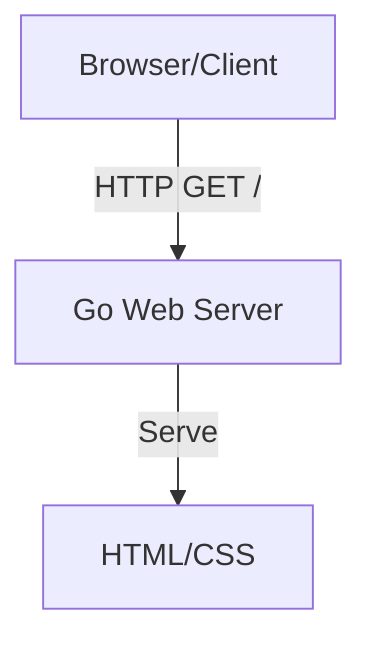

# Plan: Go E-Commerce Product Page

Build a simple product display page in Go that shows a single widget for $1. This is the first step in building an e-commerce demonstration site.

## Architecture Overview



## Core Requirements (Gherkin)

### Feature: Display Product Page
```gherkin
Feature: Product Display
  As a customer
  I want to view the widget product
  So that I can decide to purchase it

  Scenario: View product page
    Given I am on the homepage
    Then I should see the widget product
    And I should see the price "$1.00"
    And I should see a "Buy Now" button
```

## Implementation Steps

1. **Initialize Go project structure** — Create go.mod with module name, directory structure (cmd/server/main.go, internal/handlers, internal/config, templates/, static/css/, static/images/), and basic HTTP server setup with router
2. **Create product page handler** — Implement `GET /` endpoint in internal/handlers/product.go that renders the product page template using html/template
3. **Build templates** — Create templates/product.html with Go template syntax for product display showing widget name, description, price ($1.00), and a "Buy Now" button (non-functional for now)
4. **Add modern CSS styling** — Create static/css/main.css with modern CSS (CSS Grid/Flexbox, CSS variables for theming, clean responsive design without frameworks)
5. **Configure static file serving** — Set up file server for static/ directory, configure server port in internal/config/config.go, add README.md with setup and run instructions

## Technical Decisions

- **Styling**: Simple, modern CSS with CSS Grid/Flexbox and CSS variables — no frameworks
- **Templating**: Go's html/template for server-side rendering
- **Static Assets**: Organized in static/ directory (css/, images/) with proper file server middleware

---

This simplified plan focuses on getting the product page displayed first. Additional features like payment integration can be added incrementally.
