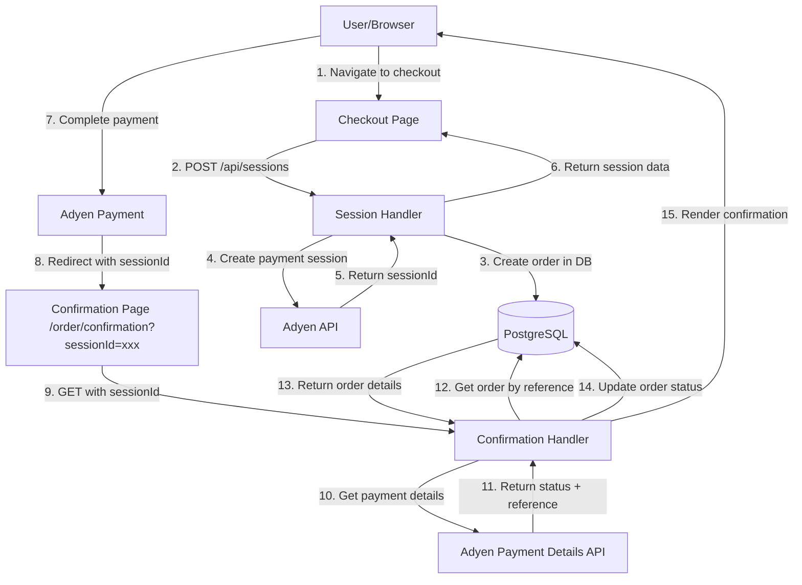
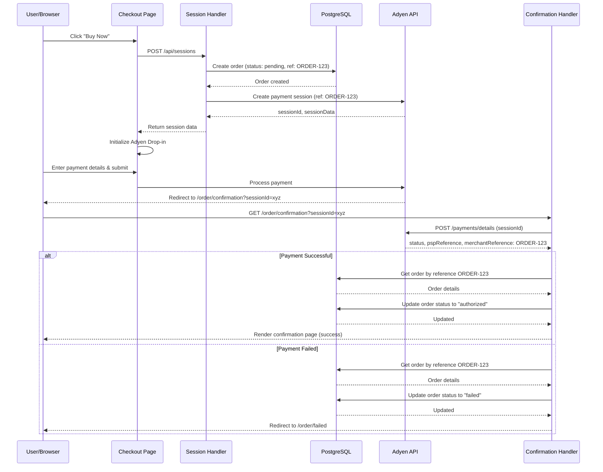

# Plan: Order Confirmation with Database Persistence

Show order confirmation page after payment with details retrieved from database. Orders are created when checkout starts and updated when payment completes.

## Architecture Overview



## Payment Flow Sequence



## Feature Requirements (Gherkin)

### Feature: Order Confirmation After Payment
```gherkin
Feature: Order Confirmation After Payment
  As a customer
  I want to see my order confirmation after completing payment
  So that I know my purchase was successful

  Scenario: Complete successful payment and view confirmation
    Given I am viewing the "Premium Widget" for "$1.00"
    When I click "Buy Now"
    And I navigate to the checkout page
    And I enter valid payment details
    And I submit the payment
    Then I should be redirected to the confirmation page
    And I should see "Order Confirmed" or "Thank You" message
    And I should see my order reference number
    And I should see "Premium Widget"
    And I should see the amount "$1.00"
    And I should see payment status "Authorized" or "Paid"

  Scenario: Return to confirmation page after payment
    Given I completed a payment for order "ORDER-123"
    And I received a confirmation page URL
    When I close my browser
    And I reopen the confirmation page URL later
    Then I should still see my order details
    And I should see order reference "ORDER-123"
    And I should see the payment status "Authorized"
    And I should see the product and amount

  Scenario: Payment declined
    Given I am on the checkout page
    When I enter payment details that will be declined
    And I submit the payment
    Then I should be redirected to a failure page
    And I should see "Payment Declined" or similar message
    And I should see my order reference
    And I should see a "Try Again" button
```

## Implementation Steps

1. **Create database connection and schema** — Implement [internal/database/postgres.go](../../internal/database/postgres.go) with `Connect()` function reading PostgreSQL credentials from environment variables (POSTGRES_USER, POSTGRES_PASSWORD, POSTGRES_DB, POSTGRES_HOSTNAME), create [internal/database/migrations.go](../../internal/database/migrations.go) with `RunMigrations()` to create orders table with columns: id (UUID PRIMARY KEY), reference (VARCHAR UNIQUE), amount (INTEGER), currency (VARCHAR), status (VARCHAR), product_name (VARCHAR), psp_reference (VARCHAR NULLABLE), created_at (TIMESTAMP), updated_at (TIMESTAMP)

2. **Create order model and repository** — Define [internal/models/order.go](../../internal/models/order.go) with `Order` struct (ID, Reference, Amount, Currency, Status, ProductName, PSPReference, CreatedAt, UpdatedAt), implement [internal/repository/order_repo.go](../../internal/repository/order_repo.go) with methods: `CreateOrder(*Order) error`, `GetOrderByReference(string) (*Order, error)`, `UpdateOrderStatus(reference, status, pspReference string) error`

3. **Initialize database on server startup** — Update [cmd/server/main.go](../../cmd/server/main.go) to call `database.Connect()` on startup, run `database.RunMigrations()`, create `OrderRepository` instance, pass repository to handlers that need it, implement graceful shutdown with `defer db.Close()`

4. **Update session handler to create orders** — Modify [internal/handlers/session.go](../../internal/handlers/session.go) to accept `OrderRepository` dependency, before calling Adyen Sessions API create order in database with status "pending" and same reference as used for Adyen (line 92 currently generates reference), handle database errors gracefully and return error to client if order creation fails

5. **Update session ReturnUrl** — Change [internal/handlers/session.go](../../internal/handlers/session.go) line 93 from `ReturnUrl: "http://localhost:8080/checkout"` to `ReturnUrl: "http://localhost:8080/order/confirmation"` so Adyen redirects to confirmation page after payment

6. **Create confirmation handler** — Implement [internal/handlers/confirmation.go](../../internal/handlers/confirmation.go) with `ConfirmationHandler` accepting `AdyenConfig` and `OrderRepository`, extract `sessionId` from query parameter, call Adyen Payment Details API (`POST /payments/details` with sessionId), extract `merchantReference` and payment status from response, retrieve order from database by reference, update order status ("Authorised" → "authorized", "Refused" → "failed"), redirect to `/order/failed?reference=X&reason=Y` for failed payments, render confirmation template for successful payments

7. **Create confirmation template** — Build [templates/confirmation.html](../../templates/confirmation.html) showing success message, order reference, payment status badge (green "Authorized"), product details (name, amount), PSP reference if available, and "Return to Home" button linking to `/`

8. **Create failure handler and template** — Implement [internal/handlers/failure.go](../../internal/handlers/failure.go) extracting `reference` and `reason` from query parameters, optionally retrieve order from database for display, render [templates/failure.html](../../templates/failure.html) showing error message based on reason, order reference, and "Try Again" button linking to `/checkout`

9. **Register routes** — Update [cmd/server/main.go](../../cmd/server/main.go) to add routes: `/order/confirmation` (GET) → `ConfirmationHandler`, `/order/failed` (GET) → `FailureHandler`, pass required dependencies (AdyenConfig, OrderRepository) to handlers

10. **Update checkout template** — Modify [templates/checkout.html](../../templates/checkout.html) to remove `alert()` from `onPaymentCompleted` callback (line ~170) since Adyen will handle redirect automatically with configured returnUrl

11. **Add CSS styles** — Enhance [static/css/main.css](../../static/css/main.css) with styles for confirmation and failure pages: status badges (green for success, red for failure), order details card layout, error message styling

## Technical Decisions

- **Database**: PostgreSQL with `github.com/lib/pq` driver using existing docker-compose setup
- **Order Creation Timing**: Create order in database when session is created (before payment), not after payment completes
- **Payment Verification**: Use Adyen Payment Details API with sessionId to get authoritative payment status server-side
- **Order Reference**: Generate once when creating session, use same reference for both Adyen and database
- **Status Mapping**: 
  - Adyen "Authorised" → Database "authorized"
  - Adyen "Refused" → Database "failed"
  - Adyen "Cancelled" → Database "cancelled"
- **Error Flow**: Redirect to `/order/failed` page for non-successful payments
- **No Webhooks**: Not implementing webhooks in this iteration (can be added later for reliability)
- **Connection Pooling**: Max 25 open connections, max 10 idle, 5 minute lifetime

## Dependencies

Add to [go.mod](../../go.mod):
- `github.com/lib/pq` - PostgreSQL driver
- `github.com/google/uuid` - UUID generation for order IDs

## Environment Variables

Existing in [.devcontainer/.env](../../.devcontainer/.env):
```
POSTGRES_USER=postgres
POSTGRES_PASSWORD=postgres
POSTGRES_DB=postgres
POSTGRES_HOSTNAME=localhost
```

---

**Note**: This plan provides a complete order confirmation flow with database persistence. Webhooks can be added in a future iteration for improved reliability but are not required for the core user experience.
